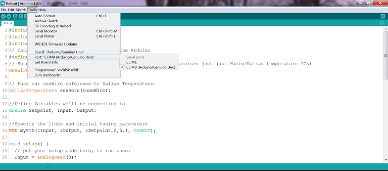
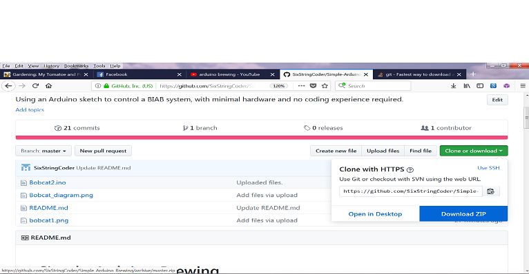
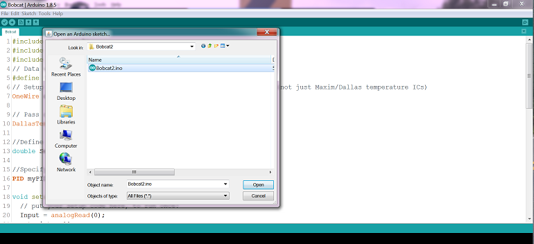

# Simple-Arduino-Brewing
Using an Arduino sketch to control a BIAB system, with minimal hardware and no coding experience required.

  This sketch uses an Arduino, a few simple inexpensive components and a serial port connection (any computer) to control a single vessel electric home brewery.  This setup would be best for those who BIAB.  

### Aim
- No coding or coding knowledge required
- Minimal hardware
- A good project for those who want to learn about electronics and coding in general.  Heavily commented code with clear explanations about connecting hardware.
- Good documentation.  
- Brewing good beer.

### Hardware
- Arduino
- Dallas DS18B20 Temp Sensor
- Solderless breadboard and jumper wires or a protoboard to solder everything
- 5mm LED and resistor  (Try a 680 ohm or something close for the resistor)
- A way to connect the wires to the bread board, 2 pin screw terminal blocks, aligator clips, whatever works or you have laying around.
- 4.7k ohm resistor (pullup resistor for the temp sensors)

  This hardware list only covers what you'll need for the electronic control, the 220v stuff (like an SSR, heating element etc etc) are not included in the list.  You're on your own for that.  There are many resources online to learn about those things though.  A basic setup would include something like a box or panel to mount everything in, an SSR, 220V LED indiator light, electrical wire and various grommets and plugs.  Your heating element will need some waterproof surrounding where the electrical connection is, and for your temp sensor you may wish to use a thermowell.  Again, you're on your own for this!  These are things that every electric brewing setup requires, at a minimum.  

  A more permenant setup can be made by creating a circuit layout using software such as Eagle, and paying to have it made.  It should be easier, at least starting out, to connect everything with dupont (jumper wires) and a solderless breadboard.  The breadboard can be attached to something along with the Arduino, to keep it stable while brewing.  Velcro, screws, be creative.  
  
  
  ### Arduino Setup
  The first thing to do, is download and install the Arduino IDE.  All of the information is on the [Arduino Website](https://www.arduino.cc/).  There are also many youtube videos on the subject.  If you have purchased a generic Arduino, like the ones on ebay you may need to install a different set of drivers, most likely the [CH340](https://sparks.gogo.co.nz/ch340.html).  Once you have completed this check to see if the Arduino is listed as seen in the screenshot below, and select it.  
 

Next, is to download the sketch.  On the [Simple-Arduino-Brewing Project Page](https://github.com/SixStringCoder/Simple-Arduino-Brewing) click on "Clone or download" and select "Download zip" from the menu as shown below.

Use your favorite zipper to extract the file.  I suggest [Winrar](https://www.rarlab.com/download.htm?).  Open the Arduino IDE and then open the sketch from the files you just extracted.  

Now that you have the sketch open, feel free to look around.  Even if you do not have any programming experience, the comments in the code may provide you with some clues as to what's going on.  You do not need to understand any of the code in order to upload and use this sketch!  If, you are learning to program, I invite you to look at the code and comments, try to understand it.  Make changes to it even.  If you screw it up, just download the sketch again.  

